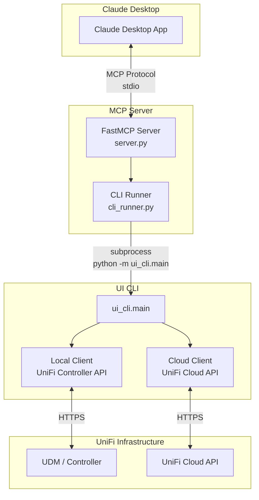

# UI-CLI MCP Server

Model Context Protocol (MCP) server for managing UniFi network infrastructure through Claude Desktop.

## Overview

This MCP server exposes UniFi management tools to Claude Desktop, allowing natural language interaction with your network. Ask questions like:

- "How many devices are connected to my network?"
- "What's my network health status?"
- "Block the kids iPad"
- "Restart the garage access point"

## Architecture



## How It Works

1. **Claude Desktop** connects to the MCP server via stdio
2. **FastMCP Server** (`server.py`) registers 16 tools with friendly names
3. **CLI Runner** (`cli_runner.py`) executes `./ui` commands via subprocess
4. **UI CLI** performs the actual API calls and returns JSON
5. **Results** flow back through the chain to Claude

### Why Subprocess?

The v2 architecture uses subprocess calls instead of direct Python imports because:

- **Single source of truth** - CLI handles all logic, formatting, error handling
- **Consistent behavior** - Same output as terminal usage
- **Easier debugging** - Test tools by running CLI directly
- **Simpler maintenance** - Add MCP tool = call existing CLI command

## Installation

### Prerequisites

- Python 3.11+ with conda environment `ui-cli`
- Claude Desktop installed
- UniFi credentials configured in `.env`

### Setup

```bash
# Install MCP server to Claude Desktop
./ui mcp install

# Verify installation
./ui mcp check

# View current config
./ui mcp show
```

### Configuration

The installer adds this to Claude Desktop's config:

```json
{
  "mcpServers": {
    "ui-cli": {
      "command": "/path/to/ui-cmd/scripts/mcp-server.sh",
      "args": [],
      "env": {
        "PYTHON_PATH": "/path/to/conda/envs/ui-cli/bin/python"
      }
    }
  }
}
```

## Available Tools

### Status & Health

| Tool | Description | Example Prompt |
|------|-------------|----------------|
| `network_status` | Check API connectivity | "Is my network API working?" |
| `network_health` | Site health summary | "What's my network health?" |
| `internet_speed` | Last speed test result | "What's my internet speed?" |
| `run_speedtest` | Run new speed test | "Run a speed test" |
| `isp_performance` | ISP metrics over time | "How's my ISP been performing?" |

### Counts & Lists

| Tool | Description | Example Prompt |
|------|-------------|----------------|
| `client_count` | Count clients by category | "How many devices are connected?" |
| `device_list` | List UniFi devices | "What UniFi devices do I have?" |
| `network_list` | List networks/VLANs | "Show my networks" |

### Lookups

| Tool | Description | Example Prompt |
|------|-------------|----------------|
| `find_client` | Find client by name/MAC | "Find my iPhone" |
| `find_device` | Find device by name/MAC/IP | "Show the living room AP" |
| `client_status` | Check if client is online/blocked | "Is the TV online?" |

### Actions

| Tool | Description | Example Prompt |
|------|-------------|----------------|
| `block_client` | Block from network | "Block the kids iPad" |
| `unblock_client` | Restore access | "Unblock the kids iPad" |
| `kick_client` | Force disconnect | "Disconnect my laptop" |
| `restart_device` | Reboot device | "Restart the garage AP" |
| `create_voucher` | Create guest WiFi code | "Create a guest WiFi voucher" |

## File Structure

```
src/ui_mcp/
├── __init__.py       # Package init, version
├── __main__.py       # Entry point: python -m ui_mcp
├── server.py         # FastMCP server + 16 tool definitions
├── cli_runner.py     # Subprocess wrapper for CLI calls
└── README.md         # This file
```

## Development

### Testing Tools

Run the test script to validate all tools:

```bash
python scripts/test-mcp-tools.py
```

### Adding a New Tool

1. Add CLI command with `--json` output support
2. Add tool function in `server.py`:

```python
@server.tool()
async def my_new_tool(param: str) -> str:
    """Tool description shown to Claude.

    Args:
        param: Parameter description
    """
    result = run_cli(["lo", "mycommand", param])
    if "error" in result:
        return format_result(result)
    return format_result(result, "Human-readable summary")
```

3. Test with `python scripts/test-mcp-tools.py`

### Debugging

Check MCP server logs in Claude Desktop:
- macOS: `~/Library/Logs/Claude/mcp*.log`

Test CLI runner directly:

```python
from ui_mcp.cli_runner import run_cli
result = run_cli(["lo", "health"])
print(result)
```

## Troubleshooting

### "Conda environment not found"

The wrapper script couldn't find the `ui-cli` conda environment. Ensure:

```bash
conda activate ui-cli
./ui mcp install  # Re-install with correct Python path
```

### "No output" in Claude Desktop

1. Restart Claude Desktop after config changes
2. Check that `.env` file exists with credentials
3. Run `./ui mcp check` to verify setup

### Tools timeout

Increase timeout in `cli_runner.py` for slow operations:

```python
result = run_cli(["lo", "health"], timeout=60)
```

## Version History

- **v0.2.0** - Tools layer architecture (subprocess-based)
- **v0.1.0** - Direct API calls (deprecated)
